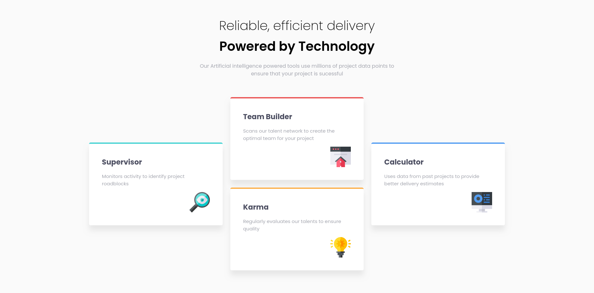

# Frontend Mentor - Four card feature section solution

This is a solution to the [Four card feature section challenge on Frontend Mentor](https://www.frontendmentor.io/challenges/four-card-feature-section-weK1eFYK). Frontend Mentor challenges help you improve your coding skills by 

## Table of contents

- [Overview](#overview)
  - [Screenshot](#screenshot)
  - [Links](#links)
- [My process](#my-process)
  - [Built with](#built-with)
  - [What I learned](#what-i-learned)
  - [Continued development](#continued-development)
- [Author](#author)
## Overview

### Screenshot



### Links

- Solution URL: [GitHub](https://github.com/chkg2a/FRMentor-Four-Cards)
- Live Site URL: [Netlify Live Preview](https://chk-four-cards.netlify.app/)

## My process

### Built with

- Semantic HTML5 markup
- CSS custom properties
- Grid
- Flexbox
- [React](https://reactjs.org/) - JS library

### What I learned

This is essentially my first time building a project as It's been many years ago since I've made a website. I used ReactJs for this proect, I don't remember much css but I'm also doing [TheOdinProject](https://www.theodinproject.com/) on the side, fundamental knowledge from the TheOdinProject is helping me alot in this project

I learned a lot of css. First of all I learned about grid
```css
.card-container {
  margin-top: 5vh;
  display: grid; 
  gap: 1.5rem;
  grid-template-columns: repeat(3, 1fr);
  grid-template-rows: repeat(4, 1fr);
}
```
I learned about grid-row and grid-column
```css
.card-1 {
  grid-row: 2 / 4;
  grid-column: 1;
  border-top: 4px solid hsl(180, 62%, 55%);
}
```
Learned about minmax() property
```css
.card img {
  height: minmax(5vw,10vw);
  width: minmax(5vw,10vw);
  align-self: flex-end;
}
```
### Continued development
I'm still very new to this. But I'm willing to push on forwards. As there is so many interesting things to build. I'll try many projects from [frontendmentor.io](https://www.frontendmentor.io)


## Author

- Website - [ChK](https://chkxrenne.xyz)
- Frontend Mentor - [@chkg2a](https://www.frontendmentor.io/profile/chkg2a)

